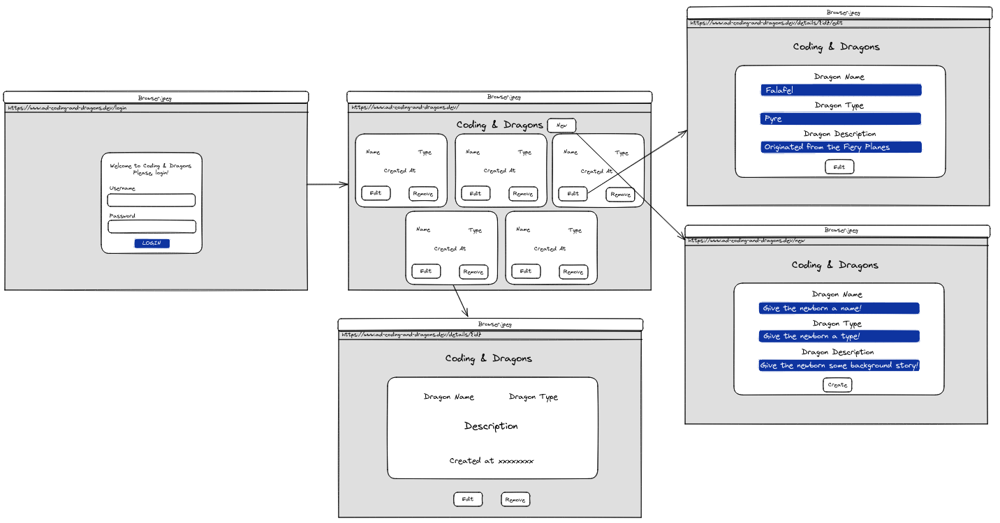

# Woop Sicredi Dev Challenge
Welcome, this is my solution to the Woop Sicredi Front-End Developer Challenge.

## Table of Contents
- [Overview](#overview)
  - [The challenge](#the-challenge)
  - Demos 
  - Links
- [My process](#my-process)
  - [Built with](#built-with)
  - [How to setup the project](#how-to-setup-the-project)
- [Technical Design](#technical-design)
  - [Background](#background)
  - [Design Spec](#design-spec)
  - [Login Page](#login)
  - [Home Page](#home)
  - [New Dragon](#new)
  - [Editing Dragon Data](#detailsidedit)
  - [Removing Dragons](#removing-dragons)
  - [Dragon Details](#detailsid)
- [Author](#author)
---

## Overview
### The challenge
The goal of this challenge is to know whether or not the developer can create multi page applications that can consult an API, perform basic CRUD operations and render the data derived from these operations. For this challenge, users should be able:
- Login
- See a simple page that lists the dragons fetched from the API
- Have access to specific detail pages for each dragon on the list
- Have the ability to create new dragons, update their data, render the new dragons on the list page and delete them if wanted to

The constraints are:
- Should not use CSS libraries
- Should use React, Angular, Stencil or Web Components
- Should create a responsive layout

## My process

### Built with
This project will be built using:
- CRA
- React.js
- TypeScript
- Jest
- SASS
- React Router

### How to setup the project
You can setup the project locally by running these commands on your terminal:
```bash
git clone https://github.com/Will-Andrade/woop-sicredi-devtest.git && cd woop-sicredi-devtest && npm install
```
This will clone the project, change directory to it and install all necessary dependencies for you. Later, to run the project, simply:
```bash
npm start
```

## Technical Design
#### Background
Now I will explain my thinking process that I used on the solution, step by step. The goal is to create a multi page SPA, I will be using React.js, React Router and TypeScript to achieve this.

#### Design Spec


I will be using 5 different pages: `/login`, `/home`, `/new`, `/details/{id}`, `/details/{id}/edit`.

#### /login
This page will contain a simple login form, with a predetermined id and password. The user should be able to login and be redirected to the home page.

**Errors**
- If the id and password do not match the existing account, an error should be displayed with this message: `Error! Invalid account!`

**Tests**
- `should render the error message if account doesn't exist`
- `should successfully sign in if account exists`
- `should render the /home on successful login`

#### /home
This page will contain a list of available dragons, each rendered inside a card with their name, type, creation date and edit / remove functionalities. From here, users should also be able to create new dragons.

To list dragons, a request to this endpoint will be made once and whenever the database data changes:
```ts
GET /api/v1/dragon
```

**Errors**
- If there is any problem with the request to fetch dragons, an error should be displayed with this message: `Apparently there was an error! Please try again later!`

**Tests**
- `should render a list of dragons`
- `should render a paragraph asking to add more dragons if there is none`

#### /new
On clicking on the `new` button, the user should be redirected to the `/new` route. There, a form with name/type/description should be rendered. On submit, this data should be sent to the API on a payload similar to this:

```ts
type Dragon {
  name: string;
  type: string;
  description: string;
}
```

Endpoint:
```ts
POST /api/v1/dragon
```

**Errors**
- If there is any problem with the request to create a dragon, an error should be displayed with this message: `There was an error creating your dragon! Please, try again later!`

**Tests**
- `should be able to create a dragon`
- `should render an error message if any form input is left blank`

#### /details/{id}/edit
On clicking on the `edit` button, the user should be redirected to `/details/{id}/edit`. There, the same form will be rendered but now containing the existing dragon data on it. If the users edits anything and then submits the form, a request will be made to the endpoint:

```ts
PUT /api/v1/dragon/:id
```

**Errors**
- If there is any problem with the request to edit dragons, an error should be displayed with this message: `There was an error editing your dragon information! Please, try again later!`

**Tests**
- `should update correct dragon data on submit`
- `should not update if nothing is changed`

#### Removing dragons
On clicking on the `remove` button, the correct dragon should be deleted from the list and API. A simple request with the `dragon id` to this endpoint should do the trick:
```ts
DELETE /api/v1/dragon/:id
```
**Tests**
- `should remove the dragon from the list on deletion`
- `should redirect to the home page if deletion happens on details page`

#### /details/{id}
Whenever the user clicks on a dragon card, the details page for that dragon should be rendered. Here, a simple card with the dragon's name, type, creation date and description will be rendered with edit / remove functionalities as well. To get the correct dragon data, a request to this endpoint will be made:

```ts
GET /api/v1/dragon/:id
```

**Errors**
- If there is any problem with the rendering of the dragon, an error should be displayed with this message: `There was an error fetching your dragon data! Please, try again later!`

**Tests**
- `should render the data from the correct dragon`


### Author
- [Excalidraw file](https://excalidraw.com/#json=8moDIpksYp27I5k5NQIDv,zLyN8sSwFb7goVcQcuPngA)
- [GitHub](https://excalidraw.com/#json=8moDIpksYp27I5k5NQIDv,zLyN8sSwFb7goVcQcuPngA)
- [LinkedIn](https://www.linkedin.com/in/will-andrad/)
<p align="center">
  <a href="#table-of-contents">Back to top</a>
</p>